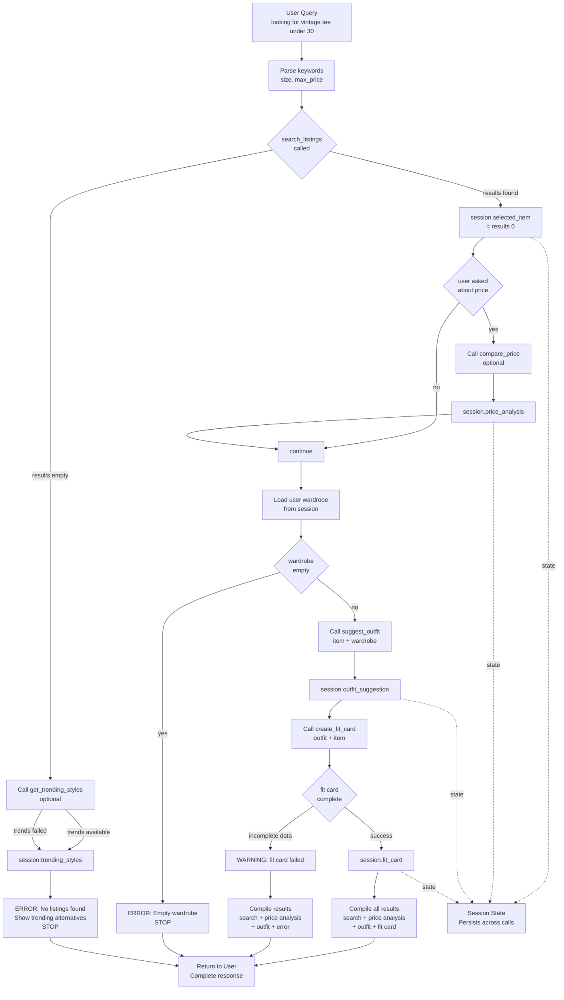

# FitFindr — planning.md

> Complete this document before writing any implementation code.
> Your spec and agent diagram are what you'll use to direct AI tools (Claude, Copilot, etc.) to generate your implementation — the more specific they are, the more useful the generated code will be.
> Your planning.md will be reviewed as part of your submission.
> Update it before starting any stretch features.

---

## Tools

List every tool your agent will use. For each tool, fill in all four fields.
You must have at least 3 tools. The three required tools are listed — add any additional tools below them.

### Tool 1: search_listings

**What it does:**
Filters listings from data/listings.json by keyword match (in title, description, and style_tags), size, and maximum price. Returns matching listings sorted by relevance, with keyword matches in title/tags ranked higher than description-only matches.

**Input parameters:**
- `description` (str): Keywords to search (e.g., "vintage graphic tee"). Matched against title, description, and style_tags fields.
- `size` (str): Size filter (e.g., "M", "S/M", "W30"). Must match the size field exactly or be a range that overlaps (e.g., "M" matches "S/M").
- `max_price` (float): Maximum price threshold. Only returns listings with price <= max_price.

**What it returns:**
A list of matching listing dictionaries, each containing: id, title, description, category, style_tags, size, condition, price, colors, brand, platform. If multiple results, sorted by relevance (title matches first, then style_tags, then description). Empty list if no matches.

**What happens if it fails or returns nothing:**
Returns an empty list. The agent stops execution and tells the user: "No items matching '[keywords]' in size [size] under $[price]. Try a higher budget, different size, or broader style keywords like 'graphic tee' instead of the exact vintage style."

---

### Tool 2: suggest_outfit

**What it does:**
Takes a new listing item and the user's wardrobe, then generates a 2–3 sentence styling suggestion that pairs the new item with compatible pieces from their existing wardrobe. Considers color coordination, style_tags alignment (e.g., grunge with grunge), and category balance (tops with bottoms/shoes).

**Input parameters:**
- `new_item` (dict): The listing item being considered. Contains: id, title, category, colors, style_tags, price, condition, platform, description, brand, size.
- `wardrobe` (dict): User's wardrobe structure with an 'items' key containing a list of wardrobe items. Each item has: id, name, category, colors, style_tags, notes.

**What it returns:**
A string containing a specific styling suggestion (e.g., "Pair this with your baggy dark jeans and chunky white sneakers for a classic 2000s streetwear vibe. The black tee grounds the look. Tuck the front corner slightly for subtle shape."). Suggests specific pieces from their wardrobe by name and explains the reasoning (color match, style vibe, silhouette balance).

**What happens if it fails or returns nothing:**
If the wardrobe is empty (no items in the items list), the agent returns: "You haven't added any items to your wardrobe yet. Once you set up your closet, I can suggest how to style this piece with your existing clothes." Does not call create_fit_card if wardrobe is empty.

---

### Tool 3: create_fit_card

**What it does:**
Generates a social media-ready caption based on the outfit suggestion and item details (price, platform, condition, brand). Creates an Instagram/TikTok-style post text (under 280 characters) that captures the vibe and encourages sharing.

**Input parameters:**
- `outfit` (str): The outfit suggestion text from suggest_outfit (e.g., "Pair this with your baggy dark jeans...").
- `new_item` (dict): The listing item with: title, price, platform, condition, brand, colors, style_tags.

**What it returns:**
A string containing a social media caption (e.g., "scored this faded tour tee off depop for $24 and it's the perfect oversized fit 🖤 pairing with my baggy jeans and chunky sneakers for that early 2000s streetwear energy"). Includes the price, platform, and a conversational tone suitable for Instagram Stories/captions.

**What happens if it fails or returns nothing:**
If outfit is empty/None or new_item lacks critical fields (price, platform, title), return: "Couldn't generate a caption with incomplete outfit or item data. Please make sure the item details and outfit suggestion are complete before creating a fit card."

---

### Additional Tools (if any)

### Tool 4: compare_price

**What it does:**
Analyzes whether a listing's price is fair by comparing it against similar items in the dataset. Considers category, condition, brand, and style_tags to find comparable listings, then calculates an average market price and flags if the item is overpriced, fairly priced, or a bargain.

**Input parameters:**
- `item` (dict): The listing item with id, title, price, category, condition, brand, style_tags, colors.

**What it returns:**
A dictionary with: fair_price (float, average price of comparables), price_difference (float, item.price - fair_price), rating (str: "bargain", "fair", or "overpriced"), explanation (str: "This [category] in [condition] condition typically sells for $X. You're paying $Y, which is $Z [more/less]."). Returns null/empty rating if fewer than 2 comparables found.

**What happens if it fails or returns nothing:**
If fewer than 2 comparable listings exist (same category/condition/brand range), return: "Not enough comparable items to estimate fair price. This item is unique or rarely listed — use your judgment based on condition and brand." Still show the item's listed price to the user.

---

### Tool 5: get_trending_styles

**What it does:**
Queries a public fashion platform (e.g., hashtag data, social trends API, or mock data) to surface popular styles currently trending in the user's size range. Returns a list of trending style tags and estimated popularity scores, allowing the agent to suggest trendy alternatives if the user's search yields no results or only unpopular items.

**Input parameters:**
- `size` (str): User's size (e.g., "M", "S/M", "W28") to filter trends by size availability.
- `category` (str, optional): Category to filter trends (e.g., "tops", "bottoms"). If omitted, returns all trending categories.

**What it returns:**
A list of trending items, each with: style_tag (str, e.g., "y2k", "grunge", "cottagecore"), popularity_score (float, 0–100), example_count (int, number of recent posts/listings), size_availability (str: "common", "moderate", "rare" in the given size). Sorted by popularity_score descending.

**What happens if it fails or returns nothing:**
If no trend data is available or API fails, return: "Trend data unavailable right now. Check back later or browse popular hashtags like #thrifted, #vintage, or #y2k for style inspiration." Agent can still proceed with search_listings or show user the example wardrobe for styling ideas.

---

---

## Planning Loop

**How does your agent decide which tool to call next?**

1. **Parse user input**: Extract search criteria (keywords, size, max_price) from the user's query using natural language parsing.

2. **Call search_listings**: Invoke search_listings(description, size, max_price).
   - **Branch A (no results)**: If search_listings returns an empty list, optionally call get_trending_styles(size, category) to suggest trendy alternatives. Store the error message and trends in session and return early. **Stop here — do not proceed to suggest_outfit or create_fit_card.**
   - **Branch B (results found)**: If search_listings returns ≥1 result, select results[0] as the primary recommendation and store in session.selected_item.

3. **Optional: Price comparison** (if user asked about pricing or fairness): Call compare_price(selected_item) and store result in session.price_analysis.

4. **Check wardrobe**: Load the user's wardrobe from session.
   - **Branch C (empty wardrobe)**: If wardrobe.items is empty, inform user and return. **Stop here — do not call suggest_outfit or create_fit_card.**
   - **Branch D (wardrobe exists)**: Proceed to suggest_outfit.

5. **Call suggest_outfit**: Invoke suggest_outfit(selected_item, wardrobe). Store result in session.outfit_suggestion.

6. **Call create_fit_card**: Invoke create_fit_card(outfit_suggestion, selected_item). Store result in session.fit_card.

7. **Return complete results**: Compile the search result, price analysis (if available), styling suggestion, and fit card caption into a final response to the user. **Done.**

**Decision points that change flow**: (a) search_listings returns empty → offer trends and stop; (b) wardrobe is empty → stop; (c) user asks about price → call compare_price; (d) outfit suggestion or item data incomplete → return error for create_fit_card and still show search + suggest_outfit results.

---

## State Management

**How does information from one tool get passed to the next?**

A session dictionary stores all state and persists across tool calls within a single user interaction:

- **session.search_query**: Dict of user's search criteria {keywords, size, max_price}
- **session.search_results**: List returned from search_listings
- **session.selected_item**: The chosen listing item (results[0]) to style and feature
- **session.trending_styles** (optional): List returned from get_trending_styles if search found no results
- **session.price_analysis** (optional): Dict returned from compare_price if user asked about pricing
- **session.user_wardrobe**: User's wardrobe dict (loaded at session start or provided in query)
- **session.outfit_suggestion**: String returned from suggest_outfit
- **session.fit_card**: String returned from create_fit_card
- **session.error**: Error message if a tool fails or returns nothing

**Flow**: search_listings populates search_results → if empty, get_trending_styles offers alternatives → if results found, selected_item is extracted → optional compare_price call → selected_item + user_wardrobe go to suggest_outfit → outfit_suggestion + selected_item go to create_fit_card → final session is returned to agent for user-facing output.

If any tool fails (search returns empty, wardrobe is empty, outfit incomplete), the agent stores the error in session.error and returns early with that error message, stopping all downstream tool calls. Optional tools (compare_price, get_trending_styles) don't halt the pipeline if they fail.

---

## Error Handling

For each tool, describe the specific failure mode you're handling and what the agent does in response.

| Tool | Failure mode | Agent response |
|------|-------------|----------------|
| search_listings | No results match the query | "No items matching '[keywords]' in size [size] under $[price]. Try a higher budget, different size, or broader keywords like 'graphic tee' instead of 'vintage graphic tee.' You can also check back later for new listings." Optionally call get_trending_styles and show trending alternatives. Stop execution. |
| suggest_outfit | Wardrobe is empty | "You haven't added any items to your wardrobe yet. Once you set up your closet, I can suggest how to style this piece with your existing clothes. Add at least 3 items to get started!" Do not call create_fit_card. |
| create_fit_card | Outfit input is missing or incomplete | "Couldn't generate a caption with incomplete outfit or item data. The item is missing a price or platform. Please try again with complete listing information." Still show search result and outfit suggestion; only the fit card fails. |
| compare_price | Fewer than 2 comparable listings exist | "Not enough comparable items to estimate fair price. This item is unique or rarely listed — use your judgment based on condition and brand." Continue with search result and show the listed price. Optional tool; does not stop the pipeline. |
| get_trending_styles | No trend data available or API fails | "Trend data unavailable right now. Check back later or browse popular hashtags like #thrifted, #vintage, or #y2k for style inspiration." Optional tool; does not stop the pipeline. Agent can still proceed with search_listings or show user the example wardrobe. |

---

## Architecture

**Key flow points:**
- **Search failure** (no results) → call get_trending_styles to offer alternatives → stop with error + trends
- **Search success** → optionally call compare_price if user asked about pricing
- **Empty wardrobe** → stop early with error
- **Incomplete fit card** → show search + outfit + error (graceful degradation)
- **Success path** → all core tools execute; optional tools enhance but don't block
- **Optional tools** fail gracefully without stopping the pipeline

---

## AI Tool Plan

**Milestone 3 — Individual tool implementations:**

*Tool 1: search_listings*
- **AI tool**: Claude (Sonnet or Opus for code generation)
- **Input**: The "Tool 1: search_listings" spec block from planning.md (what it does, inputs, return value, failure mode) + data/listings.json sample to understand the structure + data_loader.py to see load_listings() function
- **Expected output**: A Python function that filters load_listings() results by description keywords (checking title, description, and style_tags), size (exact or range match), and price (<=). Returns sorted list.
- **Verification**: Test against 3 queries before committing: (1) "vintage graphic tee", size="M", max_price=30.0 → should return lst_006; (2) "nonexistent brand", size="XS", max_price=10.0 → should return empty list; (3) "denim", any size, max_price=50.0 → should return multiple results in price-sorted order.

*Tool 2: suggest_outfit*
- **AI tool**: Claude
- **Input**: The "Tool 2: suggest_outfit" spec block + wardrobe_schema.json (to understand wardrobe structure) + 1–2 example listings and example wardrobe from data files
- **Expected output**: A Python function that takes a new listing and wardrobe dict, finds color/style overlaps with wardrobe items, and returns a 2–3 sentence suggestion pairing the new item with specific wardrobe pieces.
- **Verification**: Manually test with 2 examples: (1) new_item=lst_006 (black graphic tee, vintage/streetwear) + example_wardrobe (has baggy jeans, chunky sneakers) → should mention pairing with those pieces. (2) new_item=lst_008 (brown cardigan, cozy) + empty wardrobe → should return "wardrobe empty" message.

*Tool 3: create_fit_card*
- **AI tool**: Claude
- **Input**: The "Tool 3: create_fit_card" spec block + 2–3 example outfit suggestions (strings) + example listing data
- **Expected output**: A Python function that takes outfit_suggestion string and new_item dict, generates a casual Instagram-style caption under 280 characters mentioning price, platform, and outfit vibe.
- **Verification**: Test with 2 examples: (1) outfit="Pair with baggy jeans and chunky sneakers", item=lst_006 ($24, depop) → caption should mention price, platform, and 2000s vibe. (2) outfit missing or item missing price → should return error message.

*Tool 4: compare_price*
- **AI tool**: Claude
- **Input**: The "Tool 4: compare_price" spec block + data/listings.json (to find comparables) + 1–2 example items to price-check
- **Expected output**: A Python function that filters listings by category + condition + brand, calculates average price, returns dict with fair_price, price_difference, rating (bargain/fair/overpriced), explanation string. If <2 comparables, return rating=null with explanation message.
- **Verification**: Test with 2 examples: (1) lst_006 (graphic tee, good condition) compared to other tops in good condition → should return estimated fair price and rating. (2) Unique item (1 comparable) → should return rating=null with "unique item" message.

*Tool 5: get_trending_styles*
- **AI tool**: Claude
- **Input**: The "Tool 5: get_trending_styles" spec block. Since a real public API (Instagram, TikTok, etc.) is out of scope, provide mock trend data (e.g., a JSON structure with trending tags: [{"style_tag": "y2k", "popularity_score": 85, "example_count": 320, "size_availability": "common"}])
- **Expected output**: A Python function that takes size and category, returns mock/mocked trend data filtered by availability in that size. Returns list of dicts with style_tag, popularity_score, example_count, size_availability sorted by score descending.
- **Verification**: Test with 2 examples: (1) size="M", category="tops" → should return trending tops in M (y2k, grunge, etc.) with scores. (2) API/mock data unavailable → should return error message string.

**Milestone 4 — Planning loop and state management:**

- **AI tool**: Claude
- **Input**: The updated "Planning Loop" section (including optional compare_price and get_trending_styles calls), "State Management" section (including session.price_analysis and session.trending_styles), and the updated Architecture Mermaid diagram. Also input all five tool specs.
- **Expected output**: A Python agent/main function that (a) parses user query, (b) calls search_listings and checks for empty results, (c) if empty, calls get_trending_styles and returns error + trends, (d) if results found, optionally calls compare_price if user asked about pricing, (e) loads user wardrobe and checks if empty, (f) calls suggest_outfit on results[0], (g) calls create_fit_card, (h) compiles and returns final session dict with all results, price analysis, and errors.
- **Verification**: Run end-to-end with the example query ("vintage tee under $30, baggy jeans, chunky sneakers") and verify: (1) search returns lst_006, (2) outfit suggestion mentions jeans+sneakers, (3) fit card caption includes price ($24) and platform (depop), (4) all results appear in final output. Test error paths: (1) search for impossible criteria → no results error + trending styles. (2) empty wardrobe → wardrobe error. (3) search with "is this price fair?" → call compare_price and show rating.

---

## A Complete Interaction (Step by Step)

FitFindr searches for items matching the user's criteria, suggests outfit pairings with pieces from their existing wardrobe, and generates a social media caption. It stops at search if no listings match, without attempting to suggest an outfit or create a card.

**Example user query:** "I'm looking for a vintage graphic tee under $30. I mostly wear baggy jeans and chunky sneakers. What's out there and how would I style it?"

**Step 1 — Search:** 
The agent calls `search_listings("vintage graphic tee", size="M", max_price=30.0)` to filter the listings dataset. The search returns 1 matching item: "Graphic Tee — 2003 Tour Bootleg Style" ($24, good condition, black, lst_006) which is under $30 and tagged with "graphic tee" and "vintage."

**Step 2 — Suggest Outfit:**
The agent calls `suggest_outfit(new_item=<lst_006 tee>, wardrobe=<user's wardrobe>)`. The wardrobe contains baggy dark jeans and chunky white sneakers (w_007). suggest_outfit returns: "Pair this with your baggy dark jeans and chunky white sneakers for a classic 2000s streetwear vibe. The black tee grounds the look. Tuck the front corner slightly for subtle shape."

**Step 3 — Create Fit Card:**
The agent calls `create_fit_card(outfit=<suggestion>, new_item=<lst_006>)` to generate a social post caption. It returns: "scored this faded tour tee off depop for $24 and it's the perfect oversized fit 🖤 pairing with my baggy jeans and chunky sneakers for that early 2000s streetwear energy"

**Final output to user:**
The agent displays the search result (item, price, platform), the styling suggestion with tips on how to wear it, and the fit card caption the user can post to social media.

**Error path:** If `search_listings` returns an empty list, the agent stops and tells the user: "No vintage graphic tees under $30 in size M right now. Try searching with a higher budget, different size, or broader style keywords." It does not call `suggest_outfit` or `create_fit_card`.
